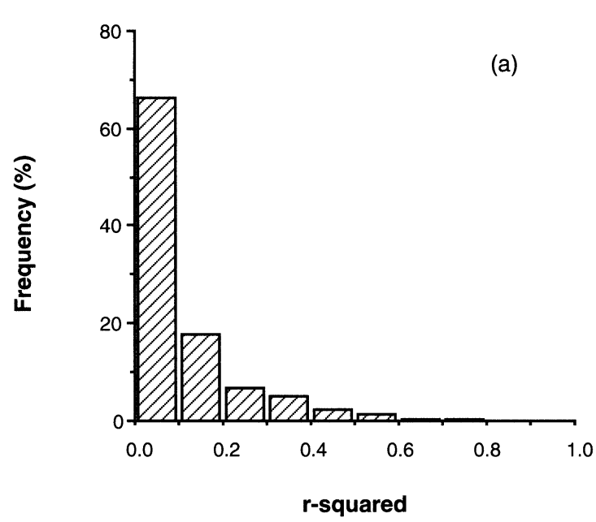

```{r setup, echo = FALSE}
knitr::opts_chunk$set(
  comment = "#",
  collapse = TRUE,
  cache = TRUE,
  warning = FALSE,
  message = FALSE,
  fig.width = 6, fig.height = 6,
  fig.retina = 3,
  fig.align = 'center'
)
options(repos=structure(c(CRAN="http://cran.r-project.org")))
```

class: inverse, center, middle

```{r install_pkgs, message=FALSE, warning=FALSE, include=FALSE, results=0}

# Standard procedure to check and install packages and their dependencies, if needed.

# Install xaringanExtra and countdown
if(nzchar(system.file(package = "xaringanExtra")) == FALSE) {
  remotes::install_github("gadenbuie/xaringanExtra", 
                          upgrade = "always", 
                          quiet = TRUE)
  }
if(nzchar(system.file(package = "countdown")) == FALSE) {
  remotes::install_github("gadenbuie/countdown", 
                          upgrade = "always", 
                          quiet = TRUE)
  }

list.of.packages <- c('dplyr', 'vegan', 'e1071', 'MASS', 'car', 'effects')

new.packages <- list.of.packages[!(list.of.packages %in% installed.packages()[,"Package"])]

if(length(new.packages) > 0) {
  install.packages(new.packages, dependencies = TRUE) 
  print(paste0("The following package was installed:", new.packages)) 
} else if(length(new.packages) == 0) {
    print("All packages were already installed previously")
  }
```

# About this workshop

[](https://r.qcbs.ca/workshop04/pres-en/workshop04-pres-en.html)
[](https://r.qcbs.ca/workshop04/book-en/index.html)
[](https://r.qcbs.ca/workshop04/book-en/workshop04-script-en.R)
[](https://github.com/QCBSRworkshops/workshop04) [](https://r.qcbs.ca/workshops/r-workshop-04)

---

<p style="font-size:60%">

.center[
**Contributors to the development of this workshop**

by modifying and improving its content as part of the <br> *Le*arning *a*nd *D*evelopment *A*ward
]

.pull-left[
.right[
 **2022** - **2021** - **2020**

[Victor Cameron]()

[Laurie Maynard]()

[Daniel Schoenig]()

[Pedro Henrique P. Braga]()
<br>

**2019** - **2018** - **2017**

[Willian Vieira]()

[Shaun Turney]()

[Marie-Hélène Brice]()

[Katherine Hébert]()

]
]

.pull-right[
.left[

**2016** - **2015** - **2014**

[Catherine Baltazar]()

[Bérenger Bourgeois]()

[Zofia Taranu]()

[Shaun Turney]()

[Maxwell Farrell]()

[Emmanuelle Chrétien]()

[Vincent Fugère]()

]
]

</p>

---

# Required material

To follow this workshop, you are required to have downloaded and installed the latest [RStudio](https://rstudio.com/products/rstudio/download/#download) and [R](https://cran.rstudio.com/) versions.

.pull-left3[
You must also use these packages:


* [dplyr](https://cran.r-project.org/package=dplyr)
* [vegan](https://cran.r-project.org/package=vegan)
* [e1071](https://cran.r-project.org/package=e1071)
* [MASS](https://cran.r-project.org/package=MASS)
* [car](https://cran.r-project.org/package=car)
* [effects](https://cran.r-project.org/package=effects)

<br>

All workshop materials are found at [r.qcbs.ca/workshops/r-workshop-04/](https://r.qcbs.ca/workshops/r-workshop-04/).

]

.pull-right3[

To install them from CRAN, run:

```{r, echo = TRUE, eval = FALSE}
install.packages(
  c('dplyr', 
    'vegan', 
    'e1071', 
    'MASS', 
    'car', 
    'effects')
)
```

]

---
# Learning objectives

.large[Learn the structure of a linear models and its *different variants*]

--

.center[

]

???

Presenter notes: This flow chats represents all the variants of a linear modal that will be presented in this presentation.

---
# Learning objectives

.large[Learn the structure of a linear models and its different variants]
<br>
<br>
.large[Learn how to perform a linear model with R with `lm()` and `anova()`]
<br>
<br>
.large[Learn how to identify when assumptions are not met and ways to fix it]

---

# What is a linear model?

#### A **linear model** ...

... describes the relationship between one variable (the **response**) and one or more other variables (the **predictors**).

... is used to investigate a **well-formulated hypothesis**, usually based on a more general research question.

... is used to make inferences about the **direction** and **strength** of a relationship, and our **confidence** in the effect estimates.


???

- Bring across: There is a large amount of scientific work involved before formulating a linear model.
- It is good practice to explicitly formulate expectations about direction and strength of a relationship as predictions before fitting a linear model.

---

# Example: Abundance and mass of bird species

#### Hypothesis

> For bird species, the average mass of an individual has an effect on the maximum abundance of the species, due to ecological constraints (food sources, habitat availability, etc.).

#### Prediction
> Species with larger individuals have a lower maximum abundance.

--

.center[

**Group discussion**

*Which variable is the response? Which the predictor?*
  
*What is the expected direction and strength of the relationship?*
]

???

- Short: Fatter birds -> less food and space
- Response: Maximum abundance
- Predictor: Average weight (of an individual)
- Direction: Inverse or "negative" (higher weight results in lower abundance)
- Strength: No expectation!


---

# Example: Abundance and mass of bird species

#### Let us have a look at the data...

Import the `birdsdiet` dataset:

```{r, eval=TRUE, echo=FALSE}
bird <- read.csv("data/birdsdiet.csv", stringsAsFactors = TRUE)
```

```{r, eval = FALSE}
bird <- read.csv("birdsdiet.csv", stringsAsFactors = TRUE)
```

Visualize the data using the structure `str()` command:

```{r}
str(bird)
```

???

- It's enough to explain the variables of interest for now (more info on the data set can be found in the wiki: <https://wiki.qcbs.ca/r_workshop4#running_a_linear_model>)
- `MaxAbund`: The highest observed abundance at any site in North America (continuous / numeric)
- `Mass`: The body size in grams (continuous / numeric)

---

# Example: Abundance and mass of bird species

#### Let us have a look at the data...

.pull-left[
Common **measures of location** (central tendency):

<br>

- Arithmetic **mean** $\bar{x} = \frac{1}{n} \sum_{i=1}^{n} x_{i}$
```{r}
mean(bird$MaxAbund)
```
<br>
- **Median** (value separating higher half from lower half of a sample)
```{r}
median(bird$MaxAbund)
```
]

.pull-right[
Common **measures of spread** (dispersion):

<br>

- **Variance** $\sigma^2 = \frac{1}{n} \sum_{i=1}^{n} {(x_{i} - \bar{x})}^2$
```{r}
var(bird$MaxAbund)
```
<br>
- **Standard deviation** $\sigma$ 
```{r}
sd(bird$MaxAbund)
```
]

???

- This is only meant to recall the basics. 
- Participants who are struggling with these measures may have a hard time understanding the other concepts presented in the course.
- Yes, there are other types of means that we usually don't need for linear models: geometric, harmonic, ...
- The definition for the median is omitted because it can be confusing to some participants: $\mathrm {median} (x)={\frac {1}{2}}(x_{\lfloor (n+1)/2\rfloor }+x_{\lceil (n+1)/2\rceil })$

---

# Example: Abundance and mass of bird species

Plot the response against the predictor:

```{r}
plot(bird$Mass, bird$MaxAbund)
```

???
- Make sure participants understand how the plot is related to the hypothesis!

---

# Example: Abundance and mass of bird species

How do we find the "best" estimate of the relationship?

```{r, eval=FALSE}
plot(bird$Mass, bird$MaxAbund)
```

```{r, echo=FALSE}
plot(bird$Mass, bird$MaxAbund)
abline(coef = c(70, -.03),  lwd = 1.5, lty = 2, col = palette()[2])
abline(coef = c(20, -.005), lwd = 1.5, lty = 2, col = palette()[4])
abline(coef = c(200, -.1),  lwd = 1.5, lty = 2, col = palette()[6])
```


???
- The question is intended to remain unanswered for now.
- The "best" estimate is the line that minimizes the sum of squares, which should become clear through the next slides
- The "best" estimate can also be: There is no relationship (similar to the blue line in the plot).

---

# Formulation of a linear model

#### Variables

- $y_i$ is an observation of the **response** $y$  
  (*e.g.* maximum abundance of species $i$)

- $x_i$ is a corresponding observation of the **predictor** $x$  
  (*e.g.* average weight of an individual of species $i$)
<br>

#### Assumed relationship

$$ y_i = \beta_0 + \beta_1 \times x_i + \epsilon_i$$

- Paramter $\beta_0$ is the **intercept**
- Parameter $\beta_1$ quantifies the **effect** of $x$ on $y$
- The residual $\epsilon_i$ captures **unexplained** variation
- The **fitted** (or predicted) value of $y_i$ is defined as: $\hat{y}_i = \beta_0 + \beta_1 \times x_i$

???
- Take time with this slide, all definitions are important.
- Understanding parameters: important for knowing what will be estimated and later interpreted
- Understanding residuals and fitted values: Important for model checking later on
- Theoretically, participants should know all this from their stats courses; in practice, knowledge of the definitions sometimes shaky 

---

# Assumptions of the linear model


$$y_i = \beta_0 + \beta_1 \times x_i + \epsilon_i$$

#### Normal distribution

The **residuals** $\epsilon$ follow a **normal distribution** with mean $0$ and variance $\sigma^2$: 
$$\epsilon_i \sim \mathcal{N}(0,\,\sigma^2)$$

```{r, echo=FALSE, fig.height=4, fig.width=6}
x <- seq(-5, 5, length=100)
p <- dnorm(x, 0, 1)
plot(x, p, type = "l", lty = 2, lwd = 1.5,  xlab = "Residuals", ylab = "Probability", xaxt = "n")
```

---

# Assumptions of the linear model


$$y_i = \beta_0 + \beta_1 \times x_i + \epsilon_i$$

#### Normal distribution

The **residuals** $\epsilon$ follow a **normal distribution** with mean $0$ and variance $\sigma^2$: 
$$\epsilon_i \sim \mathcal{N}(0,\,\sigma^2)$$

**This means:** Each *single* observation $y_i$ follows a normal distribution,  
with mean $\hat{y} = \beta_0 + \beta_1 \times x_i$ and variance $\sigma^2$: 

$$y_i \sim \mathcal{N}(\hat{y},\,\sigma^2)$$

.alert[**This does not mean**] that the whole set of observed values $y$ ~~must follow a normal distribution~~.

???
- The misconception that $y$ rather than $\epsilon$ must follow a normal distribution is very common.


---

# Assumptions of the linear model

$$y_i = \beta_0 + \beta_1 \times x_i + \epsilon_i$$
$$\epsilon_i \sim \mathcal{N}(0,\,\sigma^2)$$


#### Homoskedasticity
- All residuals $\epsilon$ follow the same distribution, the **variance** $\sigma^2$ stays **constant**.

<br>
<br>

#### Independence of residuals
- Each residual $\epsilon_i$ is **indepedent** from all other residuals. 

---

# Assumptions of the linear model

$$y_i = \beta_0 + \beta_1 \times x_i + \epsilon_i$$
$$\epsilon_i \sim \mathcal{N}(0,\,\sigma^2)$$

#### Summary of assumptions
- Linear relationship between response and predictor
- Residuals follow a normal distribution with mean $0$
- Residuals are identically distributed (*homoscedasticity*)
- Residuals are independent from each other


???

- The full definition of a linear model always consists of both equations shown.


---

# Notation for linear models

##### Mathematical notation (for manuscripts)

- Individual observations:  
  $y_i = \beta_0 + \beta_1 \times x_i + \epsilon_i \quad \textrm{with} \quad \epsilon_i \sim \mathcal{N}(0,\,\sigma^2)$
<br>

- All observations (matrix notation, intercept included in $\mathbf{X}$ and $\boldsymbol{\beta}$):   
  $\mathbf{y}= \mathbf{X}\boldsymbol{\beta} + \mathbf{\epsilon} \quad \textrm{with} \quad \epsilon_i \sim \mathcal{N}(0,\,I_n\sigma^2)$  

--

##### `R` notation: compact symbolic form

.pull-left[
Model formula:  
```{r, eval=FALSE}
y ~ 1 + x
```  
]

.pull-right[
Or, even simpler: 
```{r, eval=FALSE}
y ~ x
```  
(also includes intercept)
]

--

Which are the same as defining the `x` and `y` arguments:
```{r, eval=FALSE}
y = variable_name, x = variable_name, ...
```  


.center[.alert[Never mix different kinds of notation!]]


???

- This is meant to help participants understand different model descriptions they may encounter
- It is not necessary to go into detail of the matrix notation.
- R notation is not adequate for publication.


---

# Fitting a linear model

$$y_i = \beta_0 + \beta_1 \times x_i + \epsilon_i$$
$$\epsilon_i \sim \mathcal{N}(0,\,\sigma^2)$$

#### Model estimation
- Find the "best" estimates of the parameters $\beta_0,\, \beta_1$
- The "best" parameters are those, that minimize the sum of the squared residuals $\sum{\epsilon_i^2}$
- This method is called **ordinary least squares** (OLS)


---
# Learning objectives

.center[

]


---
class: inverse, center, middle

# Linear regression in `R`

---

# Linear regression in `R`

Back to the birds...

```{r}
plot(bird$Mass, bird$MaxAbund)
```

---

# Linear regression in `R`

#### Model formulation

> *Hypothesis*: For bird species, the **average size of an individual has an effect on the maximum abundance** of the species, due to ecological constraints (*e.g.*, food sources, habitat availability).

--

**Model equation**

$$\textrm{MaxAbund}_i = \beta_0 + \beta_1 \times \textrm{Mass}_i + \epsilon_i \;, \quad \epsilon_i \sim \mathcal{N}(0, \sigma^2)$$

<br>

--

**Model formula in `R`**:

.pull-left[
Compact symbolic form
```{r, eval=FALSE}
MaxAbund ~ Mass
```
]

.pull-right[

]


???
- Model formulation can be posed as a question to the participants


---

# Linear regression in `R`

.center[.small[
**Step 1**   
Fit a linear model based on a hypothesis

**Step 2**  
Verify assumptions of the linear model
]]

<br>

.pull-left[.center[]] .pull-right[.center[]]

.pull-left[.center[*Assumptions are met?*]

.small[.center[**Step 3**  ]
- Analyze regression parameters
- Plot your model
- Test for significance of parameter estimates (if necessary) 
]]

.pull-right[.center[*Assumptions are not met?*]

.center[Consider using a *Generalized Linear Model* (GLM) or transforming the data]

.pull-left[.center[]] .pull-right[.center[]]

.small[
.pull-left[
Use a GLM that is better suited for the data
]

.pull-right[
Go back to Step 1 with transformed variables
]]]

---

# Linear regression in `R`

#### **Step 1.** Fit a linear model

The function `lm()` is used to fit a linear model, providing an R *model formula* as the first argument:


```{r eval=TRUE}
lm1 <- lm(MaxAbund ~ Mass, data = bird)
```

- `lm1` : New object containing the linear model we created
- `MaxAbund ~ Mass` : Model formula
- `bird` : object holding the variables


---

# Linear regression in `R`

#### **Step 1.** Fit a linear model

Let's look at the parameter estimates:

```{r, eval=TRUE}
lm1
```

.center[
*How do the parameters compare to our prediction?*
]

--

.center[
**Can we trust these estimates?**
]


???
- Questions can be used for a discussion
- The prediction was: *Species with larger individuals have a lower maximum abundance.*
- The parameter for `Mass`*does not align with our prediction* because it is positive!
- We don't know if can trust the estimates -- for that we need step 2

---
# Linear regression in `R`

#### **Step 2.** Verify assumptions using diagnostic plots of the residuals

We can produce **four diagnostic plots** of an `lm` object:

```{r, eval=FALSE, fig.height=6, fig.width=8}
par(mfrow=c(2,2))
plot(lm1)
```

- `par()` : Function to set graphical parameters
- `mfrow=c(2,2)`:  Graphical parameter to display a grid of 2 x 2 at once
- `plot()`: The generic function to plot graphics in R

???

- How to go back to show only one plot at a time: `par(mfrow=1)`

---

# Linear regression in `R`

#### **Step 2.** Verify assumptions using diagnostic plots of the residuals

```{r, eval=FALSE}
par(mfrow=c(2,2)
plot(lm1)
```

```{r, echo=FALSE, fig.height=4.75, fig.width=5.5}
par(mfrow=c(2,2), mar = c(4,4,2,1.1), oma =c(0,0,0,0))
plot(lm1)
```

.center[**How do we interpret these plots?**]

---

# Diagnostic plot # 1 - Residuals vs Fitted

**What we see:**  
* **Y**-axis: Residuals $\epsilon_i$
* **X**-axis: Fitted values $\hat{y_i} = \beta_0 + \beta_1 \times x_i$

<span style="color:green">**What we hope to see:**</span> Random scatter, no pattern 

**Why:** Shows whether residuals are *independent* and *identically distributed*

```{r, echo = FALSE, fig.height=5, fig.width=6.5}
  set.seed(1234564)
  x <- rnorm(100,10,10)
  y <- 2*x+0 + rnorm(100)
  lm <- lm(y~x)
  plot(lm, which = 1)
```

???
- The random scatter is sometimes described as "stars in the night sky"

---
# Diagnostic plot # 1 - Residuals vs. Fitted

.alert[What should make you suspicious:]

```{r, echo=FALSE, fig.height=4.5, fig.width=8.5, warning=FALSE}
par(mfrow=c(1,2))
set.seed(1234564)
x = rnorm(100,10,10)
y = (x)^2 + rnorm(length(x),0,30)
lm=lm(y~scale(x))
plot(lm,which = 1, main = "Nonlinear", col.main="red")

x = abs(rnorm(100,10,10))
y = (x) + rnorm(length(x), 0, x)
lm=lm(y~scale(x))
plot(lm,which = 1, main = "Heteroscedastic", col.main="red")
```

**What to do:**
- Use a **generalized linear model** (GLM) instead that allows for other error distributions, such as Poisson, binomial, negative binomial.
- Attempt **transforming** the response and/or predictor variables

???
- Explain that "heteroscedastic" is the opposite of "homoscedastic", meaning that the normality assumption is violated.

---

# Diagnostic plot # 2 - Scale-Location

**What we see:**  
* **Y**-axis: Square-root of standardized residuals $\sqrt{\frac{\epsilon_i}{\sigma}}$
* **X**-axis: Fitted values $\hat{y_i} = \beta_0 + \beta_1 \times x_i$

<span style="color:green">**What we hope to see:**</span> Random scatter, no pattern 

**Why:** Violations of assumptions are sometimes easier to detect than in the first plot, especially when the predictor is not uniformly distributed.

```{r, echo=FALSE, fig.height=4.5, fig.width=6, warning=FALSE}
set.seed(1234564)
x <- 1:100
y <- x + rnorm(100,sd=5)
lm=lm(y~x)
plot(lm,which = 3)
```


???

We want the red line to be approximately horizontal, so that the average magnitude of the standardized residuals does not change much as a function of the fitted values.

We also want  the spread around the red line to not vary  vary with the fitted values.

---

# Diagnostic plot # 2 - Scale-Location

.alert[What should make you suspicious:]

```{r, echo=FALSE, fig.height=4.5, fig.width=6, warning=FALSE}
set.seed(2)
x = abs(rnorm(100,10,10))
y = (x) + rnorm(length(x), 0, x)
lm=lm(y~scale(x))
plot(lm,which = 3)
```

.center[*Strong pattern in the residuals*]

???

- What to do? Same as plot #1.

---

# Diagnostic plot # 3 - Normal Quantile-Quantile

**What we see:**  
* **Y**-axis: Standardized residuals $\frac{\epsilon_i}{\sigma}$
* **X**-axis: Standard normal distribution $\mathcal{N}(0, \sigma^2)$

<span style="color:green">**What we hope to see:**</span> Points clearly on the 1:1 line 

**Why:** Compares the distribution (quantiles) of the residuals with a standard normal distribution

```{r, echo=FALSE, fig.height=4.5, fig.width=6, warning=FALSE}
set.seed(1234564)
x <- 1:100
y <- x + rnorm(100,sd=5)
lm=lm(y~x)
plot(lm, which = 2)

```


---

# Diagnostic plot # 3 - Normal Quantile-Quantile

.alert[What should make use suspicious:]

```{r, echo=FALSE, fig.height=4.5, fig.width=6, warning=FALSE}
set.seed(2)
x = abs(rnorm(100,10,10))
y = (x) + rnorm(length(x), 0, x)
lm=lm(y~scale(x))
plot(lm, which = 2)
```

.center[*Residuals do not follow a normal distribution*]


---

# Diagnostic plot # 4 - Residuals vs. Leverage

**Why:**

- The model should **not depend strongly on single observations**
- **Leverage points** are extreme observations of the predictor. 
- The **model passes close to leverage points**, because they lack neighboring observations.
- Leverage points **<span style="color:red">may</span> or <span style="color:green">may not</span> have a high influence on the regression**
- Influence can be quantified by **Cook's distance: greater than 0.5 is problematic**.

---

### Examples: Leverage and influence

.center[.small[
These plots show the response _versus_ the predictor.  
*They are* **not** *the diagnostic plots*. 
]]

```{r, echo=FALSE, fig.height=7.8, fig.width=7.5, warning=FALSE}
par(mfrow=c(3, 1), 
    mar = c(4, 15, 1, 3), 
    cex = 1.2)

set.seed(1234564)

x <- 1:20
y <- rnorm(x, x, 2)
lm0 <- lm(y ~ x)

# plot 1
plot(x, y, ylim = c(-4, 22), xlab = '', ylab = ''); abline(lm0, col = 2); points(11, -3, pch = 15)
# add 20, 10 point to the new lm
xx <- c(x, 11); yy <- c(y, -3)
abline(lm(yy ~ xx), col = 2, lty = 3)
text(-18, 10, srt=0, adj = 0, labels = '* No leverage \n* Low influence', xpd = TRUE, cex = 1.5)
# plot 2
plot(x, y, ylim = c(-4, 32), 
     xlim = c(0, 31), xlab = '', ylab = ''); abline(lm0, col = 2); points(30, 30, pch = 15)
# add 20, 10 point to the new lm
xx <- c(x, 30); yy <- c(y, 30)
abline(lm(yy ~ xx), col = 2, lty = 3)
text(-31, 15, srt=0, adj = 0, labels = '* High leverage \n* No influence', xpd = TRUE, cex = 1.5)

# plot 3
plot(x, y, ylim = c(-4, 32), xlim = c(0, 31), xlab = '', ylab = ''); abline(lm0, col = 2); points(30, 15, pch = 15)
# add 20, 10 point to the new lm
xx <- c(x, 30); yy <- c(y, 15)
abline(lm(yy ~ xx), col = 2, lty = 3)
text(-31, 15, srt=0, adj = 0, labels = '* High leverage \n* High influence', xpd = TRUE, cex = 1.5)
```

???
- All plots have the response on the y-axis and the predictor on the x-axis
- To avoid confusion: These are not diagnostic plots!

---
# Diagnostic plot # 4 - Residuals vs. Leverage

**What we see:**  
* **Y**-axis: Standardized residuals $\frac{\epsilon_i}{\sigma}$
* **X**-axis: Leverage
* Dashed red line: Cook's distance of 0.5 units

<span style="color:green">**What we hope to see:**</span> No leverage points with high influence

```{r, echo=FALSE, fig.height=4.5, fig.width=9, warning=FALSE}
par(mfrow=c(1,2))
set.seed(1234564)
x <- 1:100
y <- x + rnorm(100,sd=5)
lm=lm(y~x)
plot(lm, which = 5, main = "No influential observations", col.main=palette()[3])

set.seed(1234564)
x = abs(rnorm(100,10,10))
y = (x) + rnorm(length(x), 0, x)
lm=lm(y~scale(x))
plot(lm, which = 5, main = "Leverage point with low influence",  col.main=palette()[3])
```

---

# Diagnostic plot # 4 - Residuals vs. Leverage

.alert[What should make you suspicious:]

```{r, echo=FALSE, fig.height=6, fig.width=7, warning=FALSE}
set.seed(1234564)
x = abs(rnorm(100,10,10))
y = (x) + rnorm(length(x), 0, x)
y[29] <- 100
lm=lm(y~scale(x))
plot(lm, which = 5, main = "High leverage and high influence")
```

<br>
.alert[You should never remove outliers unless you have exceptional reasons to do it.]

???
- Point 29 has high leverage and a Cook's distance of > 0.5
- Potential reason to move outliers: Obvious measurement error

---

# **Step 2**. Verify assumptions of `lm1`

```{r, eval=FALSE, fig.height=6, fig.width=7.5}
par(mfrow=c(2,2))
plot(lm1)
```

```{r, echo=FALSE, fig.height=6, fig.width=7.5}
par(mfrow=c(2,2), mar = c(4,4,2,1.1), oma =c(0,0,0,0))
plot(lm1)
```

**Group discussion:** Does `lm1` violate any of the assumptions from linear models?

???

- Plot 1 and 2: Strong patterns
- Plot 3: the residuals are not normally distributed
- Plot 4: point 32 has high leverage and (very) high influence

---
# Some assumptions are not met: what is wrong?

Let us plot our model on top of the observations:

```{r, fig.height=4, fig.width=11}
par(mfrow = c(1,2))
coef(lm1) # intercept and slope
plot(MaxAbund ~ Mass, data=bird) # left plot
abline(lm1) # line described by model parameters
hist(residuals(lm1)) # right plot: distribution of residuals
```

---
# Some assumptions are not met: what is wrong?

To see if the residuals follow a normal distribution, we can also use the *Shapiro-Wilk* and *Skewness* tests:

```{r}
shapiro.test(residuals(lm1))

library(e1071)
skewness(residuals(lm1))
```

.comment[The distribution is significantly different from a normal distribution, and is left-skewed (positive skewness).]


---
# Some assumptions are not met: what now?

*There are two options when assumptions of the linear model are not satisfied:*

<br>

1. Use a **different type of model** better suited to the hypothesis and data (QCBS R Workshops 6, 7 and 8).
2. Attempt perfoming the **transformation** of the predictor and / or response variables:
  - **Several types of transformations exist**. Their usefulness depends on the distribution of the variable and the type of model.
  - Transformation can **fix some** problems but might **create others**.
  - The **results of statistical tests** on transformed data **do not automatically hold** for the untransformed data.

???

- Transformation of variables can be useful, but is often tricky in practice

---

# Challenge 1: A model on transformed variables ![:cube]

*Let us try fixing our problems with a log-log transformation.*

.pull-left[
.center[Linear model]
$$y_i = \beta_0 + \beta_1 \times x_i + \epsilon_i$$

]

.pull-right[
.center[Linear-log model]
$$y_i = \beta_0 + \beta_1 \times \log{x_i} + \epsilon_i$$
]

.pull-left[
.center[Log-Linear model]
$$\log{y_i} = \beta_0 + \beta_1 \times x_i + \epsilon_i$$

]

.pull-right[
.center[**Log-log model**]
$$\log{y_i} = \beta_0 + \beta_1 \times \log{x_i} + \epsilon_i$$
]


Log-transform both variables and add them to our data frame :

```{r}
bird$logMaxAbund <- log10(bird$MaxAbund)
bird$logMass <- log10(bird$Mass)
```

--

**Step 1.** Re-run the analysis with the log-transformed variables `logMaxAbund` and `logMass`.
Save the model as `lm2`.

**Step 2**: Verify assumptions of model `lm2` using diagnostic plots.

.pull-left2[
```{r}
lm2 <- lm(logMaxAbund ~ logMass, data = bird)
```
]
.pull-right2[
```{r, eval = FALSE}
plot(lm2)
```
]
???

- You may do it together with them, but request participants to participate. 

---

# Challenge 1: A model on transformed variables ![:cube]

**Step 1.** Re-run the analysis with the log-transformed variables
```{r}
lm2 <- lm(logMaxAbund ~ logMass, data = bird)

lm2
```

.center[
*How do the parameters compare to our prediction?*
]

<br>

.center[
**Can we trust these estimates?**
]

???
- This time the parameters align with our prediction
- BUT, we cannot believe them before checking the assumptions!

---

# Challenge 1: A model on transformed variables ![:cube]

**Step 2.** Verify assumptions of model `lm2`

```{r, eval=FALSE, fig.height=5.5, fig.width=7.5}
par(mfrow = c(2, 2)) # this divides our graphics in 2 by 2
plot(lm2)
```

```{r, echo=FALSE, fig.height=5.5, fig.width=7.5}
par(mfrow = c(2,2), mar=c(3,4,1.15,1.2))
plot(lm2)
```

--

.comment[.center[It has improved, but there are still some problems.]]

???
- There are still visible patterns in the residual plots

---
# **Step 2.** Verify assumptions of model `lm2`

```{r, fig.height=4, fig.width=11,}
coef(lm2) # intercept and slope
```

```{r, fig.height=5, fig.width=11,}
par(mfrow = c(1, 2))
plot(logMaxAbund ~ logMass, data = bird) # left plot
abline(lm2) # line described by model parameters
hist(residuals(lm2)) # right plot: distribution of residuals
```


---
# **Step 3.** Analyze parameter estimates

The `summary()` function provides more information on the fitted model.

.small[
```{r, eval = FALSE, comment=""}
summary(lm2)
```

```{r, eval = TRUE, echo = FALSE, comment=""}
summary(lm2)
```
]

???

- Take time to explain the summary:
  1. Parameter estimates and their standard deviation
  2. Results of a t-test whether the parameters are different from 0
  3. Adjusted R-squared: How well does the model explain the data?
  4. F-statistic (ANOVA): Is the model significantly different from an intercept-only model?
- Mention that t-tests and ANOVA will be discussed later
- In this case: our model is *barely* better than an intercept-only model
- Interpretation of coefficients is tricky because of log-log. One unit increase in log(Mass) decreases -0.22*log(MaxAbund). If ln, then the proportional percentage change.

---
# **Step 3.** Analyze parameter estimates

We can also extract specific parameters and results from the `lm()` model and its `summary()`:

```{r}
# Vectors of residuals and fitted values:
e <- residuals(lm2)
y <- fitted(lm2)
```

```{r}
coefficients(lm2) # coefficients
```

```{r}
summary(lm2)$coefficients # coefficients with t-tests
```

```{r}
summary(lm2)$adj.r.squared # Adjusted R squared
```

You can see what exists inside `summary(lm2)` by running `str(summary(lm2))`.

---

# Model interpretation

.center[*How well does the model support our hypothesis?*]

#### Hypothesis

> For bird species, the **average size of an individual has an effect on the maximum abundance** of the species, due to ecological constraints (_e.g._, food sources, habitat availability).

---

# Model interpretation

.center[*How well does the model support our hypothesis?*]

.small[
```{r, eval = FALSE, comment=""}
summary(lm2)
```

```{r, eval = TRUE, echo = FALSE, comment=""}
summary(lm2)
```
]

---

# Model interpretation

.center[*How well does the model support our hypothesis?*]

There is only **very little evidence** in support of the hypothesis because:

- The model does not explain the response well (*low adjusted R-squared*).
- The model is only slightly better than a model without any predictor variables (*F-test barely significant*).
- The parameter estimate for `logMass` is barely different from `0` (*t-test barely significant*).

???

- In this case, the F-test and t-test are equivalent because there is only one predictor variable).

---

# Finding a better model: terrestrial birds

*Maybe we should reformulate the hypothesis with a less extended group?*

--

#### Hypothesis

> For <span style="color:green">**terrestrial**</span> bird species, the **average size of an individual has an effect on the maximum abundance** of the species, due to ecological constraints (_e.g._, food sources, habitat availability).


---

# Finding a better model: terrestrial birds

Exclude all aquatic birds (using the operator `!`, which means "different") and fit a linear model:

```{r}
lm3 <- lm(logMaxAbund~logMass, data = bird, subset = !bird$Aquatic)

# The above line removes aquatic birds from the data (i.e. !birdsAquatic == TRUE)

# Equivalently, we could also have done as follows:
# lm3 <- lm(logMaxAbund ~ logMass, data = bird, subset = bird$Aquatic == 0)
```

```{r}
lm3
```

---

# Finding a better model: terrestrial birds

```{r, eval=FALSE, fig.height=5.5, fig.width=7.5}
par(mfrow=c(2,2))
plot(lm3)
```

```{r, echo=FALSE, fig.height=5.5, fig.width=7.5}
par(mfrow=c(2,2), mar = c(4,4,2,1.1), oma =c(0,0,0,0))
plot(lm3)
```

<br>

.comment[.center[No clear violation of assumptions.]]

---

# Finding a better model: terrestrial birds

.center[*How well does the model support our hypothesis?*]

```{r, comment=""}
summary(lm3)
```

---

# Finding a better model: terrestrial birds

.center[*How well does the model support our hypothesis?*]

.pull-left[
The model provides evidence in support of the hypothesis, because:

- The model is clearly better than a model without any predictor variables (*F-test*).
- The parameter estimate for `logMass` is clearly different from `0` (*t-test*).
- The model fits the data reasonably well (*adjusted R-squared*).

<br>

**What is a reasonable $R^2$ in ecology?**

]

--

.pull-right[


.xsmall[Frequency distribution of a $R^2$ from meta-analyses in biology for studies with the effect size Pearson’s $r$ (n=93).]
]

.xsmall[Møller & Jennions. _How much variance can be explained by ecologists and evolutionary biologists?_ Oecologia 132, 492–500. [2002](https://doi.org/10.1007/s00442-002-0952-2.]

---
# Challenge 2 

Let us put everything together!

<br>

1. Formulate a similar **hypothesis** about **maximum abundance** and **average mass of an individual** for **passerine birds**.
2. Fit a **model** to assess this hypothesis, using log-transformed variables (_i.e._ a log-log model with `logMaxAbund` and `logMass`), and assign it to an object called `lm4`.
4. **Verify assumptions** of the linear model using diagnostic plots.
5. Interpret the results: _Does the model provide **evidence for the hypothesis?**_

<br>

.comment[HINT: `Passerine` is a Boolean variable, _i.e._ `0` and `1` (look at `str(bird)`).]

---
# Challenge 2 - Solution 

#### Hypothesis

> For <span style="color:green">**passerine**</span> bird species, the **average size of an individual has an effect on the maximum abundance** of the species, due to ecological constraints (food sources, habitat availability, etc.).

---

# Challenge 2 - Solution 

Fit the model:
```{r}
lm4 <- lm(logMaxAbund ~ logMass, data=bird, subset=bird$Passerine == 1)
lm4
```

---
# Challenge 2 - Solution 

Verify assumptions:
```{r, eval=FALSE}
par(mfrow=c(2,2))
plot(lm4)
```

```{r,fig.height=6, fig.width=8, echo=FALSE}
par(mfrow=c(2,2), mar = c(4,4,2,1.1), oma =c(0,0,0,0))
plot(lm4)
```

---
# Challenge 2 - Solution 

Should we even interpret the results?
```{r, comment=""}
summary(lm4)
```

???
- The model results shoud not be interpreted because the assumptions of the linear model are clearly violated!

---

# Review: Linear regression in `R`

.center[.small[
**Step 1**   
Fit a linear model based on a hypothesis

**Step 2**  
Verify assumptions of the linear model
]]

<br>

.pull-left[.center[]] .pull-right[.center[]]

.pull-left[.center[*Assumptions are met?*]

.small[.center[**Step 3**  ]
- Analyze regression parameters
- Plot your model
- Test for significance of parameter estimates (if necessary) 
]]

.pull-right[.center[*Assumptions are not met?*]

.center[Consider using a *Generalized Linear Model* (GLM) or transforming the data]

.pull-left[.center[]] .pull-right[.center[]]

.small[
.pull-left[
Use a GLM that is better suited for the data
]

.pull-right[
Go back to **Step 1** with transformed variables
]]]

---

# Variable names

Different terms are used for *response* and *predictor* variables, depending on context and scientific field (they are not always synonyms).

<br>

.center[
|response          | predictor        |
|:-----------------|:-----------------|
|                  |explanatory var.  |
|                  |covariate         |
|outcome           |                  |
|output var.       |input var.        |
|dependent var.    |independent var.  |
]

<br>

--

.center[
|réponse           | prédicteur       |
|:-----------------|:-----------------|
|var. expliqué     |var. explicatif   |
|                  |covariable        |
|var. endogène     |var. exogène      |
|var. dépendante   |var. indépendante |
]

---

# Linear models

.center[

]

---
class: inverse, center, middle

# *t*-test and ANOVA (Analysis of Variance)

## *t*-test, One-way ANOVA, Two-way ANOVA

---
# Analysis of Variance (ANOVA) and t-test

$Y$: Response variable is **continuous**.

$X$: Explanatory variable(s) is **categorical** and have **two** (*t*-test) or more levels (ANOVA).

--

.pull-left[
.large[***t*-test** tests whether the means of the groups (or populations) are different So that:]

**H0**: $\mu_1 = \mu_2$

**H1**: $\mu_1 \neq \mu_2$

]

.pull-right[
.large[**ANOVA** tests whether two or more means of the groups (or populations) are equal. So that:]

**H0**: $\mu_1 = \mu_2 = \ldots = \mu_n$

**H1**: At least one of the group means is different across the groups.
]

--

<br>

We will cover today:

.pull-left[
**Multiple-sample, independent t-test**.
]

.pull-right[
**One-way ANOVA**: one predictor

**Two-way ANOVA**: two or more predictors
]

*Dependent (or repeated measures) variables will not be covered today.*

---
exclude: true

# ANOVA

.large[ANOVA tests whether two or more means of the groups (or populations) are equal. So that:]

```{r, echo = FALSE, fig.height=3.7, fig.width=6.5}
source('script/figAnova.R')
```

Sum-of-squares: within-treatment variance *versus* between-treatment variance

If between-treatment variance $>$ within-treatment variance:
  - The treatments affect the explanatory variable more than the random error;
  - The explanatory variable is likely to be significantly influenced by the treatments.

---
class: inverse, center, middle

# Student's *t*-test

---
# Student's *t*-test

- **Response variable**  Continuous
- **Explanatory variable**  Categorical with **2 levels**

<br>

**Assumptions**
- Data follow a normal distribution;
- Homoscedasticity, *i.e.* equality of variances between groups.

<br>

.comment[The robustness of *t*-tests increases with sample size and is higher when groups have equal sizes.]

---
# Running a *t*-test in `R`

Use the function `t.test()`

```r
t.test(Y ~ X2, data = data, alternative = "two.sided")
```

  - `Y`: response variable
  - `X2`: predictive variable (`factor`, with two levels)
  - `data`: `data.frame` or `matrix`
  - `alternative` hypothesis testing: `"two.sided"` (default), `"less"`, or `"greater"`

The *t*-test is still a linear model and a specific case of ANOVA with one factor with two levels.

Thus, the function `lm()` can also be used:

```r
lm.t <-lm(Y ~ X2, data = data)
anova(lm.t)
```

---
# Running a *t*-test in `R`

.large[Are aquatic birds heavier than non-aquatic birds?]

- Response variable: `bird$Birdmass`  `num` or continuous
- Explanatory variable: `bird$Aquatic`  factor with two levels: `1` or `0` (*i.e.* `TRUE` or `FALSE`)

<br>
First, let us visualize the data using the `boxplot()`  function:

.pull-left[
```{r eval=FALSE,fig.height=5.2, fig.width=5.5}
boxplot(logMass ~ Aquatic,
        data = bird, 
        names = c("Non-Aquatic", 
                  "Aquatic")
        )
```
]

.pull-right[
```{r eval=TRUE, echo = FALSE,fig.height=5.2, fig.width=5.5}
boxplot(logMass ~ Aquatic,
        data = bird, 
        names = c("Non-Aquatic", 
                  "Aquatic")
        )
```
]

---
# Running a *t*-test in `R`: assumption testing

Next, we must meet the assumption of homogeneity of variances.

**Option 1.** Use `var.test()` to perform an F-test to compare the variances of two samples from normal populations.

```{r}
var.test(logMass ~ Aquatic, 
         data = bird)
```

The null hypothesis is that the ratio of the variances of the populations from which `x` and `y` were drawn is equal to zero.

Here, the ratio of variances is not statistically different from `1`.

---
# Running a *t*-test in `R`: assumption testing

Next, we must meet the assumption of homogeneity of variances.

**Option 2.** Use `leveneTest()` to computes Levene's test for homogeneity of variance across groups.

```{r}
leveneTest(logMass ~ as.factor(Aquatic), 
           data = bird)
```

The null hypothesis for Levene's test is that all groups have equal population variances.

Here, we do not reject this null hypothesis.

---
class: middle

## What should I do if assumptions are not met?

- If variances between groups are not equal, we can use corrections, such as the Welch-correction (default).
- If assumptions cannot be met, the **non-parametric** equivalent of *t*-test is the Mann-Whitney test.
- If two groups **are not independent** (*e.g.* measurements on the same individual at 2 different years), you should use a **paired *t*-test**.


---
# Running a *t*-test in `R`

We may proceed with our *t*-test:

.pull-left[
```{r}
ttest1 <- t.test(logMass ~ Aquatic, 
                 var.equal = TRUE, 
                 data = bird)

# Or use lm()
ttest.lm1 <- lm(logMass ~ Aquatic, 
                data = bird)
```
]

--

.pull-right[
`var.equal = TRUE` indicates that the homogeneity of variance are equal (as we just tested). When the default `var.equal = FALSE` is run, the variance is estimated separately for both groups and the Welch modification to the degrees of freedom is used.
]

--

You can verify that `t.test()` and `lm()` provide the same results:

```{r}
ttest1$statistic^2
anova(ttest.lm1)$`F value`
```

.comment[When the assumption of equal variances is met $t^2$ follows an F-distribution.]

---
# Running a *t*-test in `R`

If $p < \alpha$ (typically, with $\alpha$ being $0.01$ or $0.05$) the null hypothesis of no difference between the two groups (*H0*) can be rejected, so that as there is less than a $\alpha$% probability the null hypothesis is correct.

.small[
```{r}
ttest1
```
]

1. First, the `p-value` is very low, so that there is a mathematical probabilistic difference in mass between the aquatic and terrestrial birds.
2. Then, the mean body mass of non-Aquatic birds is `1.583437`, and of Aquatic birds is `2.908289`.

---
exclude:true
# Group discussion

.large[Are aquatic birds heavier than terrestrial birds?]

```{r}
# Unilateral t-test
uni.ttest1 <- t.test(logMass ~ Aquatic,
                     var.equal = TRUE,
                     data = bird,
                     alternative = "less")
```

.comment[What did you conclude?]

---
exclude:true
# Group discussion

```{r}
uni.ttest1
```

Yes, aquatic birds are heavier than terrestrial birds: p-value = `r format(uni.ttest1$p.value, scientific=FALSE)`

---
# Quick poll

.pull-left[
*t*-tests allows us to test specific predictions (or the direction) of our hypothesis. So that:

H0: $\mu_1 = \mu_2$
H1: $\mu_1 > \mu_2$
H2: $\mu_1 < \mu_2$

```{r echo=FALSE}
set.seed(2021)
x = rnorm(25, 104, 15)
curve(dt(x, 24), -4, 4, lwd=2, ylab="PDF", xlab="t", main = "")
abline(h = 0, col="green2")
abline(v = 0, col="green2")
abline(v = c(-2.064, 2.064), lwd=2, col="red")
abline(v = 2.1025, col="blue", lwd = 2)
abline(v = -2.1025, col="blue", lwd=2, lty="dotted")
```
]

.pull-right[


We would like to test whether **aquatic birds are _heavier_ than terrestrial birds**. Which one should we use? 

`alternative = "???"`

1.`"two.sided"`;

2.`"less"`;

3.`"greater"`.

```{r,eval=F, echo=T}
# Unilateral t-test
uni.ttest1 <- t.test(logMass ~ Aquatic,
                     var.equal = TRUE,
                     data = bird,
                     alternative = "???")
```

]


???

Presenter note: a poll is already set up on zoom for this slide. The host simply need to activate it for it to work. Otherwise tou can always ask the students to answer in the chat.

---
# Answer

.xsmall[
```{r}
# Unilateral t-test
uni.ttest1 <- t.test(logMass ~ Aquatic,
                     var.equal = TRUE,
                     data = bird,
                     alternative = "less")
uni.ttest1

```
]

Why would `"greater"` have not worked?

.comment[Hint: check the dataset. What is the nature of the variable `Aquatic`?]

???

Presenter notes: To understand this answer, we have to understand the dataset. Aquatic is binary variable, i.e. that 0 = terrestrial birds, and 1 = aquatic birds. By default, `R` will always test in this order. So, we are actually testing whether terrestrial birds are lighter than aquatic birds. This is also points out the importance to understand your dataset.

---
class: inverse, center, middle

# ANOVA

---
# Analysis of Variance (ANOVA)

Generalization of the $t$-test for categorical variables with **two or more levels**.

Subsets variation in the response variable into additive effects of one or several factors and the interactions between them:

<br>
$$Y = \underbrace{\mu}_{\Large{\text{The average outcome}\atop\text{over all individuals}}} + \overbrace{\tau_{i}}^{\Large{\text{The average outcome over}\atop\text{all individuals in group i}}} + \underbrace{\epsilon}_{\text{Residuals}}$$

---
# Review: ANOVA

Assumptions
- Normality of residuals
- Equality (*i*.*e*. homogeneity) of within-group variances, called *homoscedasticity*.
- Plus, independency, random samples.

Complementary test
- When the ANOVA detects a significant difference between groups, it does not tell you which group (or groups) differs from the others.
- A commonly used *post-hoc test* to answer this question is the **Tukey's test**.
- You may also compare between groups using **planned comparisons**. This is more elegant, because it expects that you have an *a priori* expectation for the differences between groups.

---
# Running an ANOVA in `R`

##### Does abundance vary across different diets?
- Response variable: `MaxAbund`   `num`: continuous
- Explanatory variable: `Diet`  `factor` with 5 levels

```{r str-bird, echo=TRUE}
str(bird)
```

---
# Visualize data

First, visualize the data using `boxplot()` (alphabetical order, by default).

```{r, fig.height=5, fig.width=6.5, echo = -1}
par(mar = c(4, 4, 0.5, 1))
boxplot(logMaxAbund ~ Diet,
        data = bird,
        ylab = expression("log"[10]*"(Maximum Abundance)"),
        xlab = 'Diet')
```

---
# Visualize data

We can reorder factor levels according to group medians using the `tapply()` and `sort()` functions.

```{r, fig.height=4.5, fig.width=7, echo=-1}
par(mar=c(4,4,.1,1))
med <- sort(tapply(bird$logMaxAbund, bird$Diet, median))
boxplot(logMaxAbund ~ factor(Diet, levels = names(med)), data = bird,
        ylab = expression("log"[10]*"(Maximum Abundance)"), xlab = 'Diet')
```

---
# Visualize data

Another way to represent the effect sizes is to use `plot.design()`.

```{r, fig.height=4, fig.width=6, echo=-1}
par(mar=c(4,4,.4,1))
plot.design(logMaxAbund ~ Diet, data=bird,
            ylab = expression("log"[10]*"(Maximum Abundance)"))
```

.comment[Levels of a particular factor are displayed along a vertical line, and the overall value of the response variable, in a horizontal line.]

---
# Running an One-Way ANOVA in `R`

We can use the function `stats::lm()` to run an ANOVA:
```{r}
anov1 <- lm(logMaxAbund ~ Diet,
            data = bird)
```

We can also use an specific function called `stats::aov()`:
```{r}
aov1 <- aov(logMaxAbund ~ Diet,
            data = bird)
```

.comment[Let's work together: Try both of them and compare the outputs!]

---
# Running an One-Way ANOVA in `R`

And, here are the outputs!
```{r}
anova(anov1)
```
```{r}
summary(aov1)
```

---
# Did we violate the model assumptions?

*Are the variances in each of the groups (samples) the same?*

**Bartlett's test** of homogeneity of variances:
.small[
```{r}
bartlett.test(logMaxAbund ~ Diet, data = bird)
```
]

---
# Did we violate the model assumptions?


**Levene's test** of homogeneity of variances:

.small[
```{r}
library(car)
leveneTest(logMaxAbund ~ Diet, data = bird)
```
]

.comment[Levene's test performs better, but has a slightly higher Type II error.]


---
# Did we violate the model assumptions?

*Are the model residuals normally distributed?*

**Shapiro-Wilk's test** for normality of residuals

.small[
```{r}
shapiro.test(resid(anov1))
```
]

.comment[Assumptions of homocedasticity and normality of residuals *not violated!*]

---
# What if the assumptions were **not** met?

#### Alternatives####

1. **Transform your variables** to **normalize residuals** and-or **homogenize variances** and-or **convert a multiplicative effects into additive**. For example:

```{r eval=FALSE}
data$logY <- log10(data$Y)
```
.small[- See [Workshop 1](https://r.qcbs.ca/workshops/r-workshop-01/) for rules on data transformation;

- You must verify the assumptions once again with the transformed data adjusted in your model (*i*.*e*., `lm(Y ~ X, data)` changes to `lm(logY ~ X, data)`).
]

2. **Use a non-parametric test:** **Kruskal-Wallis'  Test** is one non-parametric equivalent to ANOVA.

```{r eval=FALSE}
stats::kruskal.test(Y~X, data)
```

---
# Output of our ANOVA model

.xsmall[
Factor levels in alphabetical order and all levels are compared to the reference level (`Insect`).

```{r}
summary(anov1)
```
]

---
# Output of our ANOVA model

On the other hand, if `lm()` is used:

.pull-left2[
.small[
```{r}
summary.lm(aov1)
```
]]

.pull-right2[
.small[
.comment[Significant difference between `Diet` groups, but we do not know which ones!]
]]

---
# *A posteriori* test

If the ANOVA detects significant differences between means, a post-hoc test is required to determine which treatment(s) differ from each other. This can be done with the `TukeyHSD()` function:

.pull-left2[
.small[
```{r}
TukeyHSD(aov(anov1), ordered = TRUE)
```
]
]
.pull-right2[
<br><br>
.comment[Only `Vertebrate` and `PlantInsect` differ]
]

---
# Representation

ANOVA results can be graphically illustrated using the `barplot()` function:

.xsmall[
```{r, fig.height=3, fig.width=7,echo=-1}
par(mar=c(3,3,0.5,0.5))
sd <- tapply(bird$logMaxAbund, list(bird$Diet), sd)
means <- tapply(bird$logMaxAbund, list(bird$Diet), mean)
n <- length(bird$logMaxAbund)
se <- 1.96*sd/sqrt(n)
bp <- barplot(means, ylim = c(0, max(bird$logMaxAbund) - 0.5))
epsilon = 0.1
segments(bp, means - se, bp, means + se, lwd=2) # vertical bars
segments(bp - epsilon, means - se,
         bp + epsilon, means - se, lwd = 2) # horizontal bars
segments(bp - epsilon, means + se,
         bp + epsilon, means + se, lwd = 2) # horizontal bars
```
]

---
class: inverse, center, middle

# Two-way ANOVA

---
# Two-way ANOVA

.pull-left[
One-Way ANOVA:

 `aov <- lm(Y ~ X, data)`
]
.pull-right[

Two-Way ANOVA:

 `aov <- lm(Y ~ X * Z, data)`

]
where,


$Y$: Response variable is **continuous**

$X$: Explanatory variable(s) is **categorical**, and usually have  **two or more levels** (or groups)

$Z$: Explanatory variable(s) is **categorical**, and usually have  **two or more levels** (or groups)


.small[.comment[The "`*`" symbol indicates that the main effects, as well, as their interaction will be included in the model.]

.comment[If use the "`+`" symbol, the main effects, but not their interaction are included.]
]
We can also represent our model with:
`aov <- lm(Y ~ X + Z + ..., data)`


---
# Two-Way ANOVA

.small[

Always start reading the output from the interaction term, then proceed to the main effects.
.small[
```r
aov <- lm(Y ~ X * Z, data)

summary(aov)
# Analysis of Variance Table
#
# Response: Y
# Df Sum Sq Mean Sq F value Pr(>F)
# X 4 5.1059 1.27647 3.0378 0.02669 *
# Z 1 0.3183 0.31834 0.7576 0.38870
# X:Z 3 2.8250 0.94167 2.2410 0.10689
# Residuals 45 18.9087 0.42019
# ---
# Signif. codes: 0 ‘***’ 0.001 ‘**’ 0.01 ‘*’ 0.05 ‘.’ 0.1 ‘ ’ 1
```
]
.small[
According to law of **parsimony**, select the model that explain the most variance with the least model parameters as possible:
If the multiplicative effect is non-signficant, you may consider a model with only the additive effects:
]

```r
aov <- lm(Y ~ X + Z, data)
```
]
---
exclude: true
# Challenge 3 

Evaluate how `log10(MaxAbund)` varies with `Diet` and `Aquatic`


.comment[Hint: Test the factors `Diet`, `Aquatic` and their interaction in a two-way ANOVA model,
*e*.*g*. `lm(Y ~ A*B)`],

.comment[where `A` is your first factor, `B` is your second and `*` is the interaction term in `R`].

---

# Challenge 3 

Evaluate how `log10(MaxAbund)` varies with `Diet` and `Aquatic`
<br>
<br>
.comment[Hint: add an interaction with `*`],
<br>
<br>
<br>
<br>
.large[
.center[
.alert[Break out rooms!]
]]

---

# Challenge 2 - Solution 

.xsmall[
```{r}
anov2 <- lm(logMaxAbund ~ Diet*Aquatic, data = bird)
summary(anov2)
```
]

---
# Challenge 3 - Solution 

.xsmall[
```{r}
anov2 <- lm(logMaxAbund ~ Diet*Aquatic, data = bird)
anova(anov2)
```
]

.comment[In this case, the only significant term of the model is the `Diet` factor.]

.comment[To adopt the most parsimonious model, we are going to remove the interaction term:]

```r
anov2 <- lm(logMaxAbund ~ Diet, data = bird)
```

---
# Linear models

.center[

]

---
class: inverse, center, middle

# ANCOVA

## Analysis of Covariance

---
# Analysis of Covariance (ANCOVA)

Here, consider the following:
$$Y = X * Z$$
where,

$Y$: Response variable is **continuous**

$X$: Explanatory variable(s) is **categorical**

$Z$: Explanatory variable(s) is **continuous**


$$Y = \mu + \text{Main Effects of Factors} + \\
            \text{Interactions between factors} + \\
            \text{Main effects of covariates} + \\
            \text{Interactions between covariates and factors} + \epsilon$$

---
# Review: ANCOVA

#### Assumptions ####

In addition to the other assumptions of linear models, **ANCOVA** must have:

- The same value range for all covariates;
- Variables that are fixed;
- Categorical and continuous variables that are not "colinear".

<br>

.small[
.comment[A **fixed** variable is one that you are specifically interested in (*e*.*g*., bird mass) whereas a **random** variable is noise that you want to control for (*e*.*g*. sites where the birds were sampled at).]]

.small[.comment[*[Workshop 6](aa) will cover linear-mixed effects models.*]]

---
# Types of ANCOVA

You can have any number of factors and/or covariates, but as their number increases, the interpretation of results gets more complex.

<br>

Frequently used ANCOVA models:

1. **One covariate and one categorical**
2. One covariate and two factors
3. Two covariates and one factor

.small[.comment[We will only see the first case today, but this will help you understand the other two kinds!]]

---
# ANCOVA with 1 covariate and 1 factor

To imagine possible goals of this analysis, you may be interested in the:

1. Effect of factor and covariate on the response variable;
2. Effect of factor on the response variable after removing effect of covariate;
3. Effect of covariate on response variable while controlling for the effect of factor.

<br>

.center[.alert[You can only meet these goals if your factor and your covariate are not related!]]

---
# ANCOVA with 1 covariate and 1 factor

<br>

```{r,echo=FALSE,fig.height=3, fig.width=10}
## functions
f1 <- function(x, a, b) {
  return(x*a+b)
}
# conf for plot
col = rgb(118, 143, 175, maxColorValue = 255)
x <- 1:20
par(mfrow = c(1, 3), mar = c(1, 1, 6.5, 4))
# plot 1
plot(x, f1(x, a=1.1,b=2), ylim = c(0, 60), type = 'l', lwd = 2.5, xaxt = "n", yaxt = "n", xlab = "", ylab = "", bty='l', col = col)
lines(f1(x, a=1.1,b=17), lwd = 2.5, col = col)
lines(f1(x, a=0.6,b=22), lwd = 2.5, col = col)
lines(f1(x, a=1.1,b=40), lwd = 2.5, col = col)
mtext('One level of the factor\n has a different slope', side = 3, line = 2, cex = 1.5)
# plot 2
plot(x, f1(x, a=.5,b=2), ylim = c(0, 60), type = 'l', lwd = 2.5, xaxt = "n", yaxt = "n", xlab = "", ylab = "", bty='l', col = col)
lines(f1(x, a=1.1,b=17), lwd = 2.5, col = col)
lines(f1(x, a=1.1,b=22), lwd = 2.5, col = col)
lines(f1(x, a=0.01,b=40), lwd = 2.5, col = col)
mtext('Many levels have\n different slopes', side = 3, line = 2, cex = 1.5)
# plot 3
plot(x, f1(x, a=1.1,b=2), ylim = c(0, 60), type = 'l', lwd = 2.5, xaxt = "n", yaxt = "n", xlab = "", ylab = "", bty='l', col = col)
lines(f1(x, a=1.1,b=17), lwd = 2.5, col = col)
lines(f1(x, a=1.1,b=22), lwd = 2.5, col = col)
lines(f1(x, a=1.1,b=40), lwd = 2.5, col = col)
mtext('No interaction', side = 3, line = 2, cex = 1.5)
```

.pull-left2[.center[.pull-left[] .pull-right[]]] .pull-right2[.center[]]

.center[.pull-left2[If the interaction is significant, you will have a scenario that looks like these]]

.pull-right2[If your covariate and factor are significant, outputs will look like this]


---
# ANCOVA: adjusted mean comparisons

To compare the mean values of each factor, conditional on the effect of the other

The `effects::effect()` function uses the output of the ANCOVA model to estimate the means of each factor level, corrected by the effect of the covariate

.small[
```{r eval=FALSE, warning=FALSE}
ancova.example <- lm(Y ~ X*Z, data=data)
# X = quantitative; Z = categorical

library(effects)
adj.means.ex <- effect('Z', ancova.exemple)
plot(adj.means.ex)
```
]

```{r,echo=FALSE,fig.height=3, fig.width=5}
# plot to simulate effects::effect() plot
a = 40; b =20; sd = 8
par(mar=c(4,4,.5,1))
plot(c(a, b), ylim = c(10, 50), xlim = c(0.9, 2.1), xlab = 'factor Z', ylab = 'Y', xaxt = 'n')
lines(c(a, b), col = 4, pch = 1.5)
segments(c(1, 2), c(a-sd, b-sd), c(1,2), c(a+sd, b+sd), lwd = 1.5, col = 'orange')
segments(c(1, 2) - .04, c(a, b) + sd, c(1, 2) + .04, c(a, b) + sd, lwd = 1.5, col = 'orange')
segments(c(1, 2) - .04, c(a, b) - sd, c(1, 2) + .04, c(a, b) - sd, lwd = 1.5, col = 'orange')
points(c(1, 2), c(a, b), pch = 16, col = 4)
axis(1, at = c(1, 2), labels = FALSE) # add ticks
mtext(c('Level 1', 'Level 2'), 1, at = 1:2, line = 0.5) # add labels to ticks
```

---
# ANCOVA with 1 covariate and 1 factor

When parsimoniality is the way to go:

- If only your factor is significant, remove the covariate -> you will have a simple **ANOVA**
- If only your covariate is significant, remove your factor -> you will have a **simple linear regression**
- If the interaction between your covariate and factor (`*`) is significant, you should explore which levels of the factor have different slopes from the others.

.alert[Verify assumptions!]

- This is very similar to what we have done so far!

---
# Running an ANCOVA in R

##### Is `MaxAbund` a function of `Diet` and `Mass`?

Response variable: **MaxAbund**
 num : quantitative continuous

Explanatory variables:
  - `Diet`  factor with 5 levels
  - `Mass`  numeric, continuous

```{r}
str(bird)
```

---
exclude: true
# Challenge 4 

  1. Use an ANCOVA to test the effect of `Diet` and `Mass` (as well as their interaction) on `MaxAbund`
```{r eval=FALSE}
ancova.example <- lm(Y ~ X * Z, data=data)
summary(ancova.example)
```

  2. Test whether the interaction is significant
```{r eval=FALSE}
ancova.example2 <- lm(Y ~ X + Z, data=data)
summary(ancova.example2)
```

---
# Challenge 4 

1- Use an ANCOVA to test the effect of `Diet` and `Mass` (as well as their interaction) on `MaxAbund`

<br>

2- Test whether the interaction is significant
<br>
<br>
<br>
<br>

.large[
.center[
.alert[Break out rooms!]
]]
---
# Challenge 3 - Solution 

<br>

```{r}
ancov1 <- lm(logMaxAbund ~ logMass*Diet,
             data = bird)
anova(ancov1)
```


Interaction between `logMass` and `Diet` is not significant

---
# Challenge 4 - Solution 

Remove the interaction term and re-evaluate the model (with only the main effects of `Diet` and `logMass`).

```{r}
ancov2 <- lm(logMaxAbund ~ logMass + Diet,
             data = bird)
anova(ancov2)
```

---
# Linear models

.center[

]

---
class: inverse, center, middle

# Multiple linear regression

---

# Multiple linear regression

Only difference to simple linear regression: **several predictor variables** are included in the model. 


#### Variables

- $y$: Response variable (**continuous**)

- $x_1, x_2, ... ,x_k$: Several predictor variables (**continuous** or **categorical**)

#### Assumed relationsip

$$y_i = \beta_0 + \beta_1x_{1,i}+\beta_2x_{2,i}+\beta_3x_{3,i}+...+\beta_kx_{k,i} + \epsilon_i$$

- Paramter $\beta_0$ is the **intercept**
- Parameters $\beta_1, \beta_2, ... ,\beta_k$ quantify the **effect** of $x_1, x_2, ..., x_k$ on $y$
- The residual $\epsilon_i$ captures **unexplained** variation
- The **fitted** (or predicted) value of $y_i$ is defined as: $\hat{y}_i = \beta_0 + \beta_1x_{1,i}+\beta_2x_{2,i}+\beta_3x_{3,i}+...+\beta_kx_{k,i}$

---

# Multiple linear regression

$$y_i = \beta_0 + \beta_1x_{1,i}+\beta_2x_{2,i}+\beta_3x_{3,i}+...+\beta_kx_{k,i} + \epsilon_i$$

$$\epsilon_i \sim \mathcal{N}(0,\,\sigma^2)$$

##### Assumptions

In addition to the usual assumptions of linear models:
- **Linear relationship** between **each** predictor variable and the response variable.
- Predictor variables are independent of each other (i.e., there is **no collinearity**).

---

# Multiple linear regression

$$y_i = \beta_0 + \beta_1x_{1,i}+\beta_2x_{2,i}+\beta_3x_{3,i}+...+\beta_kx_{k,i} + \epsilon_i$$

$$\epsilon_i \sim \mathcal{N}(0,\,\sigma^2)$$

#### If variables are collinear:

- Reduce the amount of collinear variables.
- Migrate to multidimensional analyses (see [Workshop 9](https://r.qcbs.ca/workshops/r-workshop-09/)).
- Try a pseudo-orthogonal analysis.

---

#  Multiple linear regression in R

Using the `Dickcissel` datast to test effect of climate (`clTma`), productivity (`NDVI`) and grassland cover (`grass`) on bird abundance (`abund`):

.small[
```{r, eval=TRUE}
Dickcissel = read.csv("data/dickcissel.csv")
str(Dickcissel)
```
]

---
# Verify assumptions!

.small[
Collinearity:
- Examine the degree of collinearity of all explanatory variables and variables of interest using the `plot()` function.

.pull-left[
```{r, fig.height=6, fig.width=7}
# select variables
var <- c('clTma', 'NDVI',
         'grass', 'abund')
plot(Dickcissel[, var])
```
]]

.pull-right[

.small[.comment[
If you see a pattern between any two variables, they may be collinear!

They are likely to explain the same variability of the response variable and the effect of one variable will be masked by the other
]]]

---

# Multiple linear regression in R

.small[
Run a multiple linear regression with `abund` as a function of `clTma + NDVI + grass`.

```{r,eval=FALSE}
lm.mult <- lm(abund ~ clTma + NDVI + grass, data = Dickcissel)
summary(lm.mult)
```

Verify diagnostic plots, as you did for the simple linear regression:

```{r,eval=FALSE,echo=-2}
par(mfrow = c(2, 2))
par(mfrow=c(2,2), mar = c(3.9,4,1.2,1.1), oma =c(0,0,0,0))
plot(lm.mult)
```
]

---

```{r}
lm.mult <- lm(abund ~ clTma + NDVI + grass, data = Dickcissel)
summary(lm.mult)
```
]

---
# Multiple linear regression in R

Verify diagnostic plots, as you have done for the simple linear regression.

```{r, fig.height=5.5, fig.width=8,echo=-2}
par(mfrow = c(2, 2))
par(mfrow=c(2,2), mar = c(3.9,4,1.2,1.1), oma =c(0,0,0,0))
plot(lm.mult)
```

---

# Find the best-fit model

.small[
Recall the principle of parsimony: we want to explain the most of the variance using the least number of terms as possible.
]

```{r}
summary(lm.mult)$coefficients
```


<br>
Parameters for all 3 predictor variables are significantly different from 0.

Model explains ~11% of variance in dickcissel abundance $R²_{adj} = 0.11$.

--

.alert[However: this information is irrelevant because the assumptions of the linear model are not met.]

---

# Find the best-fit model

The response variable `abund` is not linearly related to the explanatory variables.

```{r, fig.height=3.5, fig.width=11,echo=-1}
par(mfrow=c(1,3), mar=c(4, 4, 0.5, 0.5), cex = 1)
plot(abund ~ clTma, data = Dickcissel)
plot(abund ~ NDVI,  data = Dickcissel)
plot(abund ~ grass, data = Dickcissel)
```

.comment[See **Advanced section** on **polynomial regression** for solution!]

---
class: inverse, center, middle

# Optional section

## *if time and disposition allows*

---
# Optional section

1. Interpreting contrasts
2. Unbalanced ANOVA
3. Polynomial regression
4. Variance partitioning

---
exclude:true
class: inverse, center, middle

# Stepwise regression

---
exclude:true
## Stepwise regression

.small[
Run a model with everything in except the `Present` variable.

Use `step()` to iteratively select the best model,  *i*.*e*. obtain the model with the lowest Akaike's Information Criterion (AIC).
]
.small[
```{r, eval = FALSE}
lm.full <- lm(abund ~ . - Present,
              data = Dickcissel)
lm.step <- step(lm.full)
```
]

```{r, include = FALSE}
lm.full <- lm(abund ~ . - Present,
              data = Dickcissel)
lm.step <- step(lm.full)
```
.small[
 > "Stepwise multiple regression includes bias in parameter estimation, inconsistencies among model selection algorithms, an inherent (but often overlooked) problem of multiple hypothesis testing, and an inappropriate focus or reliance on a single best model."


 > "Stepwise regression is one of these things, like outlier detection and pie charts, which appear to be popular among non-statisticans but are considered by statisticians to be a bit of a joke. "

]

---
exclude:true
# Stepwise regression

.pull-left[
.tiny[
```{r eval=TRUE}
summary(lm.full)
```
]]

.pull-right[

Variables selected by the `step()` function
.tiny[
```{r}
summary(lm.step)
```
]]

.small[.comment[The model now accounts for 31.44% of the Dickcissel abundance variability.]]

---
class: inverse, center, middle

# Interpreting contrasts

---
# Interpreting contrasts

Contrasts compare each level of a factor to a baseline level. We can determine if each level of a factor are significantly different from each other.

--

The *intercept* is the baseline group and corresponds to the mean of the first (alphabetically) Diet level (`Insect`). **Add Intercept + coefficient estimates of each Diet level**

```{r}
tapply(bird$logMaxAbund, bird$Diet, mean)
coef(anov1)
coef(anov1)[1] + coef(anov1)[2] # InsectVert
coef(anov1)[1] + coef(anov1)[3] # Plant
```

.comment[What did you notice?]

---
# Interpreting contrasts

We may want to relevel the baseline:

1. Compare the Plant diet to all other diet levels

```{r,eval=FALSE}
bird$Diet2 <- relevel(bird$Diet, ref="Plant")
anov2 <- lm(logMaxAbund ~ Diet2, data = bird)
summary(anov2)
anova(anov2)
```

2. Reorder multiple levels according to median

```{r,eval=FALSE}
med <- sort(tapply(bird$logMaxAbund, bird$Diet, median))
bird$Diet2 <- factor(bird$Diet, levels=names(med))
anov2 <- lm(logMaxAbund ~ Diet2,
            data = bird)
summary(anov2)
anova(anov2)
```

.comment[Did you see change in the significance of each Diet level?]

---
# Interpreting contrasts

.comment[NOTE: the DEFAULT contrast `contr.treatment` is NOT orthogonal]

To be orthogonal:
  - Coefficients must sum to 0
  - Any two contrast columns must sum to 0

```{r}
sum(contrasts(bird$Diet)[,1])
sum(contrasts(bird$Diet)[,1]*contrasts(bird$Diet)[,2])
```

???

Presenter notes:Two contrasts are orthogonal if the sum of the products of their coefficients is null. 

---
# Interpreting contrasts

Change the contrast to make levels orthogonal (e.g. Helmert contrast will contrast the second level with the first, the third with the average of the first two, and so on)

.small[
```{r}
options(contrasts=c("contr.helmert", "contr.poly"))
sum(contrasts(bird$Diet)[,1])
sum(contrasts(bird$Diet)[,1]*contrasts(bird$Diet)[,2])
```
]
.tiny[
```{r}
anov3 <- lm(logMaxAbund ~ Diet, data = bird)
summary(anov3)
```
]

---
class: inverse, center, middle

# Unbalanced ANOVA

---
# Unbalanced ANOVA

A dataset is considered unbalanced when the sample sizes of two factor levels are not equal.

The `birdsdiet` data is actually unbalanced (number of `Aquatic` and `non-Aquatic` is not equal)

```{r}
table(bird$Aquatic)
```

Which means the order of the covariates changes the values of Sums of Squares

```{r}
unb.anov1 <- lm(logMaxAbund ~ Aquatic + Diet, data = bird)
unb.anov2 <- lm(logMaxAbund ~ Diet + Aquatic, data = bird)
```

---
# Unbalanced ANOVA

```{r}
anova(unb.anov1)
```

```{r}
anova(unb.anov2)
```
---
# Unbalanced ANOVA

To fix this problem, we can use a different approach to test the effects of each predictor.

**Type I** : Tests the effects in sequence, starting with the first predictor.

**Type II**: Tests for the presence of a main effect after the other main effect.

**Type III**: Tests for the presence of a main effect after the other main effect and interaction. 

.comment[Type I is the default type used in R which creates our problem with unbalanced data.]

.alert[If you are considering using Type II or III for your own dataset, you should read more about the subject. You can start with this] [**link**](https://mcfromnz.wordpress.com/2011/03/02/anova-type-iiiiii-ss-explained/)

---
# Unbalanced ANOVA

Now try type III ANOVA using the `Anova()` function

.pull-left[
.small[
```{r}
car::Anova(unb.anov1, type = "III")
```
]]
.pull-right[
.small[
```{r}
car::Anova(unb.anov2, type = "III")
```
]]

.comment[What have you noticed when using `Anova()`?]

---
class: inverse, center, middle

# Polynomial regression

---
# Polynomial regression

As we noticed in the section on **multiple linear regression**, `abund` was non-linearly related to some variables

To test for non-linear relationships, polynomial models of different degrees are compared.

- A polynomial model looks like this:

.center[$$\underbrace{2x^4}+\underbrace{3x}-\underbrace{2}$$]

.comment[this polynomial has 3 terms]

---
# Polynomial regression

For a polynomial with one variable (x), the *degree* is the largest exponent of that variable

<br>
.center[*this makes the degree 4*]
$$2x^\overbrace{4} + 3x - 2$$

---
# Polynomial regression

When you know a degree, you can also give it a name

```{r echo=FALSE, warning=FALSE}

poly.reg=data.frame(Degree = 0:5,
                    Name = c("Constant","Linear","Quadratic",
                             "Cubic","Quartic","Quintic"),
                    Example = c("\\(3\\)",
                                "\\(x+9\\)",
                                "\\(x^2-x+4\\)",
                                "\\(x^3-x^2+5\\)",
                                "\\(6x^4-x^3+x-2\\)",
                                "\\(x^5-3x^3+x^2+8\\)"))
knitr::kable(poly.reg, format = "html", escape=FALSE)
```

---
# Polynomial regression

Using the `Dickcissel` dataset, test the non-linear relationship between max abundance and temperature by comparing three sets of nested polynomial models (of degrees 0, 1, and 3):

```{r,echo=-c(4:6)}
lm.linear <- lm(abund ~ clDD, data = Dickcissel)
lm.quad   <- lm(abund ~ clDD + I(clDD^2), data = Dickcissel)
lm.cubic  <- lm(abund ~ clDD + I(clDD^2) + I(clDD^3), data = Dickcissel)
summ_lm.linear <- capture.output(summary(lm.linear))[c(9:12, 17, 18)]
summ_lm.quad <- capture.output(summary(lm.quad))[c(9:13, 18, 19)]
summ_lm.cubic <- capture.output(summary(lm.cubic))[c(9:14, 17, 18)]
```

---
# Polynomial regression

- Compare the polynomial models and determine which nested model we should keep
- Run a summary of this model, report the regression formula, p-values and $R^2$-adj

---
# Polynomial regression

Compare the polynomial models; .comment[which nested model we should keep?]

Run a summary of this model, report the regression formula, p-values and $R^2$-adj

.tiny[
```{r}
print(summ_lm.linear)
```
```{r}
print(summ_lm.quad)
```
```{r}
print(summ_lm.cubic)
```
]

---
class: inverse, center, middle

# Variation Partitioning

---
# Variation Partitioning

Some of the selected explanatory variables in the **multiple linear regression** section were highly correlated

Collinearity between explanatory variables can be assessed using the variance inflation factor `vif()` function of package `car`
  - Variable with `VIF > 5` are considered collinearity

```{r warning=FALSE,message=FALSE}
mod <- lm(clDD ~ clFD + clTmi + clTma + clP + grass, data = Dickcissel)
car::vif(mod)
```

---
# Variation Partitioning

Use `varpart()` to partition the variation in max abundance with all land cover variables in one set and all climate variables in the other set (leaving out NDVI)

.pull-left2[
.tiny[
```{r warning=FALSE,message=FALSE}
library(vegan)
part.lm = varpart(Dickcissel$abund, Dickcissel[ ,c("clDD","clFD","clTmi","clTma","clP")],
                  Dickcissel[ ,c("broadleaf","conif","grass","crop", "urban","wetland")])
part.lm
```
]]
.pull-right2[
<br><br>
.small[.comment[**Note**: Collinear variables do not have to be removed prior to partitioning]]
]

---
# Variation Partitioning

.pull-left[
```{r,fig.height=4,echo=-1}
par(mar=rep(0.5,4))
showvarparts(2)
```
.small[
```{r,eval=FALSE}
?showvarparts
# With two explanatory tables, the fractions
# explained uniquely by each of the two tables
# are ‘[a]’ and ‘[c]’, and their joint effect
# is ‘[b]’ following Borcard et al. (1992).
```
]]

.pull-right[
```{r,fig.height=5,echo=-1}
par(mar=rep(0.5,4))
plot(part.lm,
     digits = 2,
     bg = rgb(48,225,210,80,
              maxColorValue=225),
     col = "turquoise4")
```
]

.small[.comment[Proportion of variance explained by climate alone is 28.5% (given by X1|X2), by land cover alone is ~0% (X2|X1), and by both combined is 2.4%]]

---
# Variation Partitioning

Test significance of each fraction

- Climate set
```{r,eval=FALSE}
out.1 = rda(Dickcissel$abund,
            Dickcissel[ ,c("clDD", "clFD","clTmi","clTma","clP")],
            Dickcissel[ ,c("broadleaf","conif","grass","crop", "urban","wetland")])
```

- Land cover set
```{r,eval=FALSE}
out.2 = rda(Dickcissel$abund,
            Dickcissel[ ,c("broadleaf","conif","grass","crop", "urban", "wetland")],
            Dickcissel[ ,c("clDD","clFD","clTmi", "clTma","clP")])

```

```{r,include=FALSE}
out.1 = rda(Dickcissel$abund,
            Dickcissel[ ,c("clDD", "clFD","clTmi","clTma","clP")],
            Dickcissel[ ,c("broadleaf","conif","grass","crop", "urban","wetland")])
out.2 = rda(Dickcissel$abund,
            Dickcissel[ ,c("broadleaf","conif","grass","crop", "urban", "wetland")],
            Dickcissel[ ,c("clDD","clFD","clTmi", "clTma","clP")])
```

---
# Variation Partitioning

.pull-left[
.small[
```{r}
# Climate set
anova(out.1, step = 1000, perm.max = 1000)
```
]]

.pull-right[
.small[
```{r}
# Land cover set
anova(out.2, step = 1000, perm.max = 1000)
```
]]

.comment[Conclusion: the land cover fraction is non-significant once climate data is accounted for]

---
class: inverse, center, bottom

# Thank you for attending!


